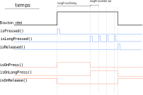

# Librairie TGP Bouton

Permet la création de boutons et leur "debouncing". Permet de détecter si le bouton a été appuyé, maintenu appuyé ou relâché.

## Détails

Le graphique illustre l'évolution temporelle de l'état du bouton et de ses différentes méthodes, lorsqu'on appuie dessus. Les valeurs retournées sont booléennes (True ou False).




## Utilisation

```cpp
#include <Bouton.h> 

const int pin = 34; 

Bouton monBouton(pin); 

void setup() {
  
}

void loop() {
  monBouton.refresh(); 

  if (monBouton.isPressed()) { 
    //condition VRAIE lorsque le bouton vient d'être appuyé.
  }
  if (monBouton.isLongPressed()) { 
    //condition VRAIE lorsque le bouton a été maintenu assez 
    // longtemps. La condition VRAIE reviendra périodiquement.

  }
  if (monBouton.isReleased())
  {
    //condition VRAIE lorsque le bouton vient d'être relâché.
  }
}
```

## Constructeurs
```cpp
Bouton(int pin)
Bouton(int pin, bool useRising, bool usePullup); 
```
On spécifie le numéro de la broche sur lequel est branché le bouton. On peut spécifier également si c'est le front montant (true) ou descendant (false) qui est considéré comme appuyé,  et l'utilisation ou non de la résistance pullup interne.


## Méthodes disponibles

```cpp
void refresh()
```
Cette méthode doit être placée en début de boucle loop(): elle permet de mettre à jour l'état du bouton sans bloquer l'exécution du reste de la boucle.

---
```cpp
bool isPressed()
```
Permet savoir si le bouton vient d'être appuyé.

---
```cpp
bool isReleased()
```
Permet savoir si le bouton vient d'être relâché.

---

```cpp
bool isLongPressed()
```
Permet savoir si le bouton vient est maintenu appuyé. La condition devient vrai après le délai prévu, et reviendra vrai à intervalles réguliers.

---

```cpp
bool isOnPress();
bool isOnRelease();
bool isOnLongPress();
```
Permet de connaître l'état du bouton; contrairement aux méthodes précédentes, la valeur peut rester vrai en continu, et non seulement lorsque du changement d'état.

---

```cpp
void setDebounceDelay(unsigned long)
unsigned long getDebounceDelay()
```
Permet de lire et modifier le temps de "debouncing" en millisecondes pour s'assurer de l'effet de rebond d'un bouton mécanique et éviter les 'faux positifs'. Valeur par défaut : 5 ms.

---
```cpp
void setLongPressDelay(unsigned long);
unsigned long getLongPressDelay();
```
Permet de lire et modifier le temps en millisecondes nécessaire pour que le bouton soit considéré comme 'maintenu longtemps'. Valeur par défaut : 1500 ms.

---
```cpp
	void setLongPressInterval(unsigned long);
	unsigned long getLongPressInterval();
```
Permet de lire et modifier le temps en millisecondes entre chaque valeur vraie de la méthode  'isLongPressed()'. Valeur par défaut : 200 ms.

---